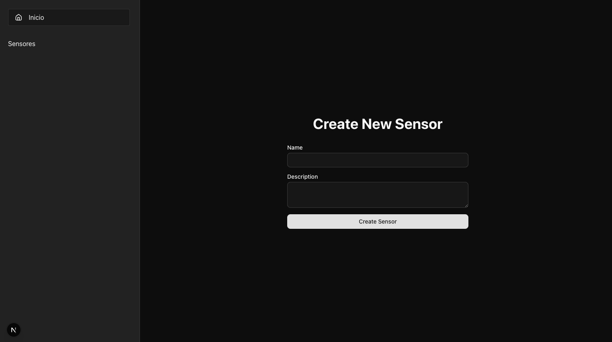

# Exercise 1

## Description

This page displays company names. Each time we click on _Fetch more_, a new name is added to the list of companies.

**But there's a problem**: the _endpoint_ used to fetch company names is very slow, so if we click _Fetch more_ too quickly, the page might end up showing fewer companies than were actually requested.



Your task is to modify the page code so that, if the user clicks _Fetch more_ while the page is waiting for the API to respond, the previous request is cancelled and only the company names from the most recent request are displayed. Also, while waiting for the API to respond, the _Fetch more_ button should change to _Cancel_. If you click _Cancel_, the request is cancelled.

## Notes

You should not modify the code of the endpoint used to fetch company names. Although you have access to this code, you can assume that this is an external service over which you have no control. The API of this service is as follows:

```
GET /api/get-companies?limit=N
```

Where `N` is the number of companies to retrieve. The response is an array of strings containing the company names.
